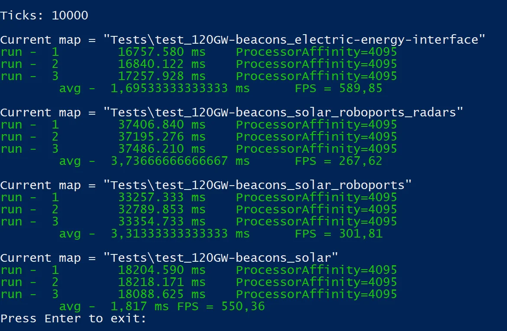

# The impact of solar power plants on UPS

## 1.Maps

### 1.1. test_120GW-beacons_electric-energy-interface

* Electricity consumer - 249k beacons (120 GW)

* Power source - electric-energy-interface ( EEI )

### 1.2. test_120GW-beacons_solar_roboports_radars [(factoriobox)](https://factoriobox.1au.us/map/info/7685bb43cbea4d2d88939a6440edf47e1f08daeb23b6ffd7af0e074145380a1b)[(Googlemap style)](https://factoriobox.1au.us/map/view/7685bb43cbea4d2d88939a6440edf47e1f08daeb23b6ffd7af0e074145380a1b/)

* Electricity consumer - 249k beacons (120 GW)

* 4800 radars + 19200 roboports + 14700 bots

* 3.4 million panels

### 1.3. test_120GW-beacons_solar_roboports

* Electricity consumer - 249k beacons (120 GW)

* 19200 roboports + 14700 bots

* 3.4 million panels

### 1.4. test_120GW-beacons_solar

* Electricity consumer - 249k beacons (120 GW)

* 3.4 million panels

## 2.Benchmark results ( Intel 10600k + ddr4-3000 ):

4800 radars = 3.737 - 3.313 = 0.424 ms

19200 roboports + 14700 bots = 3.313 - 1.817 = 1.496 ms

3.4 million panels = 1.817 - 1.695 = 0.122ms

## 3. Conclusions:

* radars are better to remove, 0.4 m sec is not so much, but radars consume 1.4GW of useful power

* it is better to remove roboports